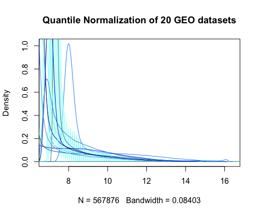

# BCB420.2019.GEO.tissues
#### (GEO (tissue) data annotatation of human genes)

----

## 1 About this package

This package will download ~20 datasets from NCBI's GEO repository and map them to HGNC symbols, quantile normalize the experiments to produce data statistics and annotate a sample gene set. 

----

## 2 GEO Data

The Gene Expression Omnibus (GEO) provided by NCBI, is a public repository for genomic data submitted by the research community. Datasets can be downloaded manually as SOFT files or MINiML files. The data download can also be downloaded in a script using the GEOquery package in Bioconductor. 


#### Method 1 - script which uses getGEO to download the the source data

When downloaded using the getGEO function, the dataset gets saved as a Bioconductor Expression Set class (see [Bioconductor's Expression Set Class documentation](https://www.bioconductor.org/packages/3.7/bioc/vignettes/Biobase/inst/doc/ExpressionSetIntroduction.pdf) for more information) which includes the title of the experiment, experiment data, assay data, feature data, and many more features of the experiment conducted.

The script **`Geo_tissues_data_download.R`** (found in "/inst/script/Geo_tissues_data_download.R") will include instructions on how to download the 18 tissue datasets from the GEO NCBI database using the **`getGEO()`** function from the GEOquery package. You simply need to source this script and all the data will be available on your environment.

The **`getGEO()`** function downloads a .gz file from the dataset corresponding to the input accession ID. THe .gz is a compressed file that contains a .txt file that is further read into R as a Bioconductor Expression Set class

It will return a character vector of the Illumina probe ID's (called **`MyexprNames`**) which will be used later to map the ID's to its matching HUGO symbol and each experiment dataset as an expression set named by its accession ID. 

#### Method 2 - Manual download from NCBI GEO using accession ID 

If you want to manually download all the files from NCBI GEO you can follow the below instructions. 

To download the source datasets from NCBI GEO... : 

1. Navigate to [NCBI GEO](https://www.ncbi.nlm.nih.gov/geo/)
2. Search "GSE64670"
3. Download the Series Matrix File(s) under the Download family sub header
4. Uncompress the file and place it into a sister directory of your working directory which is called data. 
5. Repeats steps 2-4 for the following accession ID's: GSE57820, GSE61853, GSE45643, GSE29782, GSE55924, GSE54167, GSE27411, GSE52515, GSE42529, GSE11701, GSE38823, GSE54293, GSE47363, GSE60317, GSE44240, GSE25101, GSE51220
6. Load the .txt files into the R environment using TODO:

----

## 3 Data download and cleanup

#### Preparations: packages

GEOquery is a Bioconductor package that retrieves information from NCBI's Gene Expression Omnibus (GEO). It will be downloaded via biocLite since it is a bioconductor package. 

```R
if (! require(Biobase, quietly=TRUE)) {
  if (! exists("biocLite")) {
    source("https://bioconductor.org/biocLite.R")
  }
  biocLite("Biobase")
  library(Biobase)
}

if (! require(GEOquery, quietly=TRUE)) {
  if (! exists("biocLite")) {
    source("https://bioconductor.org/biocLite.R")
  }
  biocLite("GEOquery")
  library(GEOquery)
}
```

We will also need the biomaRt package and illuminaHumanv4.db object to map our probe ID's to HGNC symbols.

```R
if (!requireNamespace("BiocManager", quietly = TRUE))
  install.packages("BiocManager")
BiocManager::install("biomaRt", version = "3.8")

if (!requireNamespace("BiocManager", quietly = TRUE))
  install.packages("BiocManager")
BiocManager::install("illuminaHumanv4.db", version = "3.8")
library("illuminaHumanv4.db")
```

And lastly, we will need the preprocessCore package for quantile normalization.

```R
if (! require(preprocessCore, quietly=TRUE)) {
  if (! exists("biocLite")) {
    source("https://bioconductor.org/biocLite.R")
  }
  biocLite("preprocessCore")
  library(preprocessCore)
}
```


---- 

## 4 Mapping Probe IDs to HGNC symbols

#### Preparations: packages, functions, files

Using the vector of probe ID's called **`MyexprNames`** created from the data sourcing script (**'GEO_tissues_data_download.R'**), we will remove any duplicates in probeID ...

```R
probeID <- MyexprNames 
length(probeID)  #699328 probe ID's extracted from the ~20 datasets
probeID <- unique(MyexprNames)
length(probeID)  #79261 unique probe ID's
```

... and map the probeID's to HGNC symbols using biomaRt...

```R
ensembl <- biomaRt::useMart("ensembl", dataset="hsapiens_gene_ensembl")

HUGOgeneAnnot <- biomaRt::getBM(attributes=c("illumina_humanht_12_v4", "hgnc_symbol", "ensembl_transcript_id"), 
      filters = "illumina_humanht_12_v4", 
      values = probeID,
      mart = ensembl)

> head(HUGOgeneAnnot)
#  illumina_humanht_12_v4 hgnc_symbol ensembl_transcript_id
#1           ILMN_1652366       NLRP7       ENST00000620820
#2           ILMN_1652366       NLRP7       ENST00000618995
#3           ILMN_1651838        RND1       ENST00000309739
#4           ILMN_1651838        RND1       ENST00000548445
#5           ILMN_1651838        RND1       ENST00000649147
#6           ILMN_1651838        RND1       ENST00000553260

nrow(HUGOgeneAnnot)  #137,830
> colnames(HUGOgeneAnnot) 
#[1] "illumina_humanht_12_v4" "hgnc_symbol"            "ensembl_transcript_id" 

#this took VERY long to map (~1hr) so make sure to save it
save(HUGOgeneAnnot, file = "HUGOMap.RData")

```

... which returns a database with columns as illumina probe id, the corresponsing HGNC symbol, and ensembl id (in order) 


```R
sum(HUGOgeneAnnot$hgnc_symbol == "")  # there are 7532 probe Id's that did not get mapped to a HGNC symbol
(sum(HUGOgeneAnnot$hgnc_symbol == "")/nrow(HUGOgeneAnnot)) *100 # 5.5% 

```

Only ~94.5% of the probe Id's from the 18 datasets successfully mapped to a HGNC symbol, to try to map the remaining 5.5% we will attempt alternative approaches. 

#### Mapping probe ID's that don't have HGNC symbols

First I will collect all the probe ID's that don't have a corresponding symbol. 

```R
sum(HUGOgeneAnnot$hgnc_symbol == "") #7532 probe ID's with empty HGNC symbols
sel <- HUGOgeneAnnot$hgnc_symbol == ""
noSym <- HUGOgeneAnnot[sel,]
nrow(noSym) #7532, confirmed that we collected all empty HGNC rows
```

#### 1. Mapping to synonyms & previous symbols in HGNC.RData
```R
#map them to the HGNC.RData file to look for synonyms or previous symbols
sel <- noSym$ensembl_transcript_id
#see if any of the ensembl ID's missing symbols are in the HGNC dataframe
HGNCsyn <- sel %in% HGNC$EnsID
HGNCmatch <- HGNC[HGNCsyn,] #no matches
```

#### 2. Mapped to illuminaHumanv4.db 
An alternative method to map our Illumina ID's to HUGO symbol's using the Bioconductor object **'illuminaHumanv4.db'** (documentation for the object can be read from [here](http://bioconductor.org/packages/release/data/annotation/manuals/illuminaHumanv4.db/man/illuminaHumanv4.db.pdf)) which maps Illumina ID's to its matching HUGO symbol. This object is slightly outdated as it used HGNC symbol data from 2015, which is why it was not used initially. 

```R
illumID <- noSym$illumina_humanht_12_v4
illumDBmatch <- data.frame(select(illuminaHumanv4.db, 
       keys = x, 
       columns=c("SYMBOL", "PROBEID"), 
       keytype="PROBEID"))

nrow(illumDBmatch) #12221
sum(is.na(illumDBmatch$SYMBOL)) #2706 
#illuminaHumanv4.db produced 12221 mappings of probe ID to hgnc symbols
#out of the 12,221 there are still 2706 probe ID's that are not matched
```

Since the mapping produced from biomaRt and the illuminaHumanv4.db do not have the same number of columns (illumina database mapping did not include the ensembl ID's) and we don't need the ensembl ID's now, we will remove the 3rd row (ensembl ID's) in the HUGOgeneAnnot dataframe and bind the newly found mappings to HUGOgeneAnnot

```R
#insert the new mappings into HUGOgeneAnnot 
> head(illumDBmatch)
#       PROBEID  SYMBOL
#1 ILMN_1652967   RDH16
#2 ILMN_1651899   RPL19
#3 ILMN_1652768    RPS2
#4 ILMN_1652580   POLD1
#5 ILMN_1652649 NECTIN2
#6 ILMN_1652786    ST13

> head(HUGOgeneAnnot)
#  illumina_humanht_12_v4 hgnc_symbol ensembl_transcript_id
#1           ILMN_1652366       NLRP7       ENST00000620820
#2           ILMN_1652366       NLRP7       ENST00000618995
#3           ILMN_1651838        RND1       ENST00000309739
#4           ILMN_1651838        RND1       ENST00000548445
#5           ILMN_1651838        RND1       ENST00000649147
#6           ILMN_1651838        RND1       ENST00000553260

all((illumDBmatch$PROBEID %in% HUGOgeneAnnot$illumina_humanht_12_v4), na.rm = FALSE) #TRUE
#making sure all newly mapped probe ID's are in HUGOgeneAnnot

#remove the 3rd row = ensembl ID's
HUGOgeneAnnot[,3] <- NULL

head(HUGOgeneAnnot)
#  illumina_humanht_12_v4 hgnc_symbol
#1           ILMN_1652366       NLRP7
#2           ILMN_1652366       NLRP7
#3           ILMN_1651838        RND1
#4           ILMN_1651838        RND1
#5           ILMN_1651838        RND1
#6           ILMN_1651838        RND1
#now same number of columns as illumDMmatch

#match the names of the columns for the 2 data frames 
colnames(illumDBmatch) <- c("illumina_humanht_12_v4", "hgnc_symbol")

#lets remove all the rows with NA for hgnc symbol (those probe ID's are already in 
#HUGOgeneAnnot so don't have to worry about losing those probe ID's)
sum(is.na(illumDBmatch)) #2706
nrow(illumDBmatch) #12221
illumDBmatch <- na.omit(illumDBmatch)
nrow(illumDBmatch) #9515 (12221 - 2706 = 9515) confirmed that only the rows with NA were removed

HUGOgeneAnnot <- rbind(HUGOgeneAnnot, illumDBmatch)
nrow(HUGOgeneAnnot) #147345 (137830 + 9515 = 147345) confirmed that all rows were successful binded
```

#### Clean up data


Now the next step is to remove all duplicate probe ID's. Duplicates were recorded because some probe ID's mapped to multiple ensembl ID's and since we removed the row with ensembl ID's, we are now left with multple dulplicate rows in our data frame.

```R
#example
HUGOgeneAnnot[c(3,4,5),]
#illumina_humanht_12_v4 hgnc_symbol
#3           ILMN_1651838        RND1
#4           ILMN_1651838        RND1
#5           ILMN_1651838        RND1
```R

For example, ILMN_1651838 was mapped to RND1 3 times in a row because it corresponded to different ensembl ID's. We don't care about the different ensembl ID's anymore, so we need to filter only unique rows in the data frame.

```R
#first remove all rows with NA because we don't care about these anymore 
#it is either a duplicate row of a probe id that we later mapped using illumina.db 
#or it is simply a probe ID that does not map to an entrez symbol
nrow(HUGOgeneAnnot)  #147345
sum(HUGOgeneAnnot$hgnc_symbol == "") #7532 
#result should be 147345 - 7532 = 139813

#changed all the empty hgnc symbols rows into NA 
HUGOgeneAnnot[HUGOgeneAnnot$hgnc_symbol=="",]<- NA
HUGOgeneAnnot <- na.omit(HUGOgeneAnnot)
nrow(HUGOgeneAnnot) #139813 successfully removed all empty rows 
sum(is.na(HUGOgeneAnnot$hgnc_symbol)) #no more empty hgnc symbols cells
```

Now we need to remove all duplicate probe ID's
```R
sum(duplicated(HUGOgeneAnnot$illumina_humanht_12_v4)) #102914 duplicated probe ID's 

uniqueProbe <- unique(HUGOgeneAnnot$illumina_humanht_12_v4)
length(uniqueProbe) #there are 36899 unique probe ID

#Keep only the unique rows (some identical probe ID's map to different hgnc id's)
dupID <- duplicated(HUGOgeneAnnot)
sum(dupID, na.rm = TRUE) #there are 96919 duplicate rows
nrow(HUGOgeneAnnot) - sum(dupID, na.rm = TRUE) #there are 42894 unique rows
HUGOgeneAnnot <- HUGOgeneAnnot[!dupID,]
nrow(HUGOgeneAnnot) #42894 confirmed that we removed out all the duplicate rows
```


However, there are still duplicated probe ID's. This is because there were multiple hgnc's recorded for that particular probe ID
```R
sum(duplicated(HUGOgeneAnnot$illumina_humanht_12_v4)) #5995 duplicate probe ID's still in the data

> tail(HUGOgeneAnnot)
#        illumina_humanht_12_v4 hgnc_symbol
#1214310           ILMN_3307747  ANKRD20A8P
#1215610           ILMN_3304413     PRAMEF1
#1215710           ILMN_3304413     PRAMEF2
#1215810           ILMN_3304413    PRAMEF14
#1216010           ILMN_3305899       RPL32
#1216310           ILMN_3305933   LOC730668

#probe ID ILMN_3304413 is associated with 3 different hgnc symbols - PRAMEF1, PRAMEF2, PRAMEF14
```

To clean this data up and make it easy to read, we will collect all hgnc symbols that map to each probe ID. 
For the duplicated probe ID's in the data, we will collect all the corresponding hgnc symbols and map them in a list to it's corresponding probe ID.

```R
#solve duplicate probe ID
sel <- duplicated(HUGOgeneAnnot$illumina_humanht_12_v4)
#save a new dataframe with just the duplicated probe ID's
dupp <- HUGOgeneAnnot[sel,]
nrow(dupp) #5995 

#make a final dataframe with only unique probe ID's
HUGOgeneAnnotFINAL <- HUGOgeneAnnot[!sel,] 
nrow(HUGOgeneAnnotFINAL) #42894 - 36899 = 5995 
#now add all the saved duplicates back into the dataframe as a list of hgnc symbols 

for (i in seq_along(dupp$illumina_humanht_12_v4)){
  #returns all the hgnc symbols with 
  probe <- dupp$illumina_humanht_12_v4[i]
  list <- HUGOgeneAnnot[HUGOgeneAnnot$illumina_humanht_12_v4 == dupp$illumina_humanht_12_v4[i],]$hgnc_symbol
  list <- paste(list, collapse = " ")
  HUGOgeneAnnotFINAL[which(HUGOgeneAnnotFINAL$illumina_humanht_12_v4 == probe),]$hgnc_symbol <- list
}
```

#### Result

Data has been cleaned up so that if a probe has more than one hgnc symbol recorded for that ID, then it will appear as a list. 

```R
> HUGOgeneAnnotFINAL[c(7,9,11),]
#   illumina_humanht_12_v4          hgnc_symbol
#11           ILMN_1652677       FAM89A MIR1182
#16           ILMN_1651606       MAGED4 MAGED4B
#23           ILMN_1652982 NPIPB5 NPIPB4 NPIPB3

#all hgnc symbols corresponding to a probe ID are listed 

nrow(HUGOgeneAnnotFINAL)
#the final mapping has 36899 probe ID's with it's corresponding hgnc symbol/s
```

Our final mapping coverage can be estimated to be greater than 95%. 
With biomaRt we returned ~94.5% coverage, and with additional mappings with illuminaHumanv4.db, we can conclude that our mapping is greater than 95%. 

The exact coverage was tricky to calculate because of duplicate probe ID's and multiple HGNC symbols mapping to a single probe.

#### Save the tool

This concludes the construction of our mapping tool and we will now save it as an RData.

```R
save(HUGOgeneAnnotFINAL, file = file.path("inst", "extdata", "probe2sym.RData"))
```

---- 

# 5 Data statistics (quantile normalization)

----

Quantile normalize all the expression matrices for the datasets
```R
GSE64670Exp <- normalize.quantiles(exprs(GSE64670))
GSE57820Exp <- normalize.quantiles(exprs(GSE57820))
GSE61853Exp <- normalize.quantiles(exprs(GSE61853))
GSE45643Exp <- normalize.quantiles(exprs(GSE45643))
GSE29782Exp <- normalize.quantiles(exprs(GSE29782))
GSE55924Exp <- normalize.quantiles(exprs(GSE55924))
GSE54167Exp <- normalize.quantiles(exprs(GSE54167))
GSE27411Exp <- normalize.quantiles(exprs(GSE27411))
GSE52515Exp <- normalize.quantiles(exprs(GSE52515))
GSE42529Exp <- normalize.quantiles(exprs(GSE42529))
GSE11701Exp <- normalize.quantiles(exprs(GSE11701))
GSE38823Exp <- normalize.quantiles(exprs(GSE38823))
GSE54293Exp <- normalize.quantiles(exprs(GSE54293))
GSE47363Exp <- normalize.quantiles(exprs(GSE47363))
GSE60317Exp <- normalize.quantiles(exprs(GSE60317))
GSE44240Exp <- normalize.quantiles(exprs(GSE44240))
GSE25101Exp <- normalize.quantiles(exprs(GSE25101))
GSE51220Exp <- normalize.quantiles(exprs(GSE51220))
```

Then plot them as a line graph to observe...

```R
plot(density(GSE64670Exp),col="dodgerblue", main = "")
title(main = "Quantile Normalization of 20 GEO datasets")
lines(density(GSE57820Exp),col="deepskyblue")
lines(density(GSE61853Exp),col="dodgerblue4")
lines(density(GSE45643Exp),col="darkslategray1")
lines(density(GSE29782Exp),col="darkturquoise")
lines(density(GSE55924Exp),col="darkslategray1")
lines(density(GSE54167Exp),col="deepskyblue4")
lines(density(GSE27411Exp),col="blue1")
lines(density(GSE52515Exp),col="darkblue")
lines(density(GSE42529Exp),col="cadetblue4")
lines(density(GSE11701Exp),col="darkcyan")
lines(density(GSE38823Exp),col="cadetblue3")
lines(density(GSE54293Exp),col="aquamarine1")
lines(density(GSE47363Exp),col="blue3")
lines(density(GSE60317Exp),col="cornflowerblue")
lines(density(GSE44240Exp),col="cyan4")
lines(density(GSE25101Exp),col="deepskyblue3")
lines(density(GSE51220Exp),col="dodgerblue")
```



# 6 Annotating gene sets with GEO data 

---- 

To conclude, we annotate the example gene set, validate the annotation, and store the data

```R
#copy and pasted from STRING database and BCB420 resources 
xSet <- c("AMBRA1", "ATG14", "ATP2A1", "ATP2A2", "ATP2A3", "BECN1", "BECN2",
          "BIRC6", "BLOC1S1", "BLOC1S2", "BORCS5", "BORCS6", "BORCS7",
          "BORCS8", "CACNA1A", "CALCOCO2", "CTTN", "DCTN1", "EPG5", "GABARAP",
          "GABARAPL1", "GABARAPL2", "HDAC6", "HSPB8", "INPP5E", "IRGM",
          "KXD1", "LAMP1", "LAMP2", "LAMP3", "LAMP5", "MAP1LC3A", "MAP1LC3B",
          "MAP1LC3C", "MGRN1", "MYO1C", "MYO6", "NAPA", "NSF", "OPTN",
          "OSBPL1A", "PI4K2A", "PIK3C3", "PLEKHM1", "PSEN1", "RAB20", "RAB21",
          "RAB29", "RAB34", "RAB39A", "RAB7A", "RAB7B", "RPTOR", "RUBCN",
          "RUBCNL", "SNAP29", "SNAP47", "SNAPIN", "SPG11", "STX17", "STX6",
          "SYT7", "TARDBP", "TFEB", "TGM2", "TIFA", "TMEM175", "TOM1",
          "TPCN1", "TPCN2", "TPPP", "TXNIP", "UVRAG", "VAMP3", "VAMP7",
          "VAMP8", "VAPA", "VPS11", "VPS16", "VPS18", "VPS33A", "VPS39",
          "VPS41", "VTI1B", "YKT6")

#for our annotation we return the corresponding Illumina ID for the sample gene set
sel <- (HUGOgeneAnnot$Gene %in% xSet)
xSetProbes <- HUGOgeneAnnot[sel,]

# Statistics:
nrow(xSetProbes) #142


# which example genes are not in our mapping?
x <- which( ! (xSet %in% HUGOgeneAnnot$hgnc_symbol))
cat(sprintf("\t%s\t(%s)\n", HGNC[xSet[x], "sym"], HGNC[xSet[x], "name"]))

#	BORCS8	(BLOC-1 related complex subunit 8)
# LAMP1	(lysosomal associated membrane protein 1)
``` 


## 7 References


